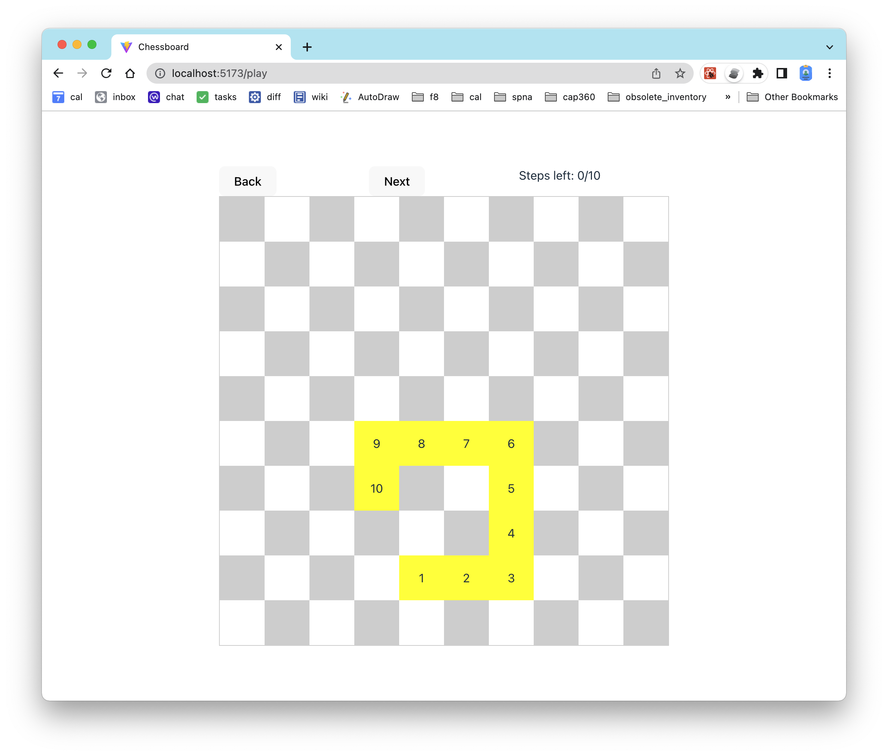
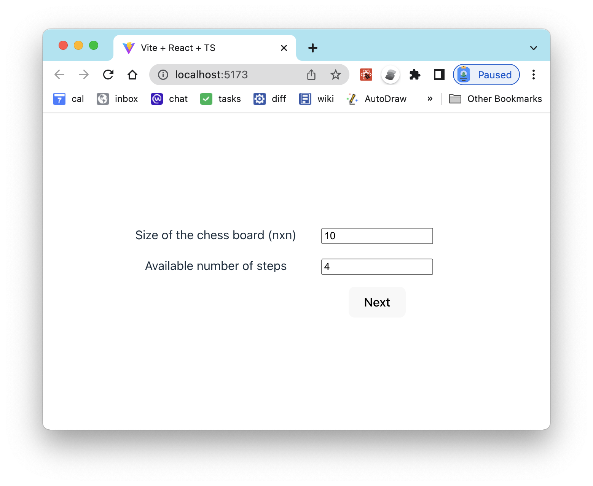
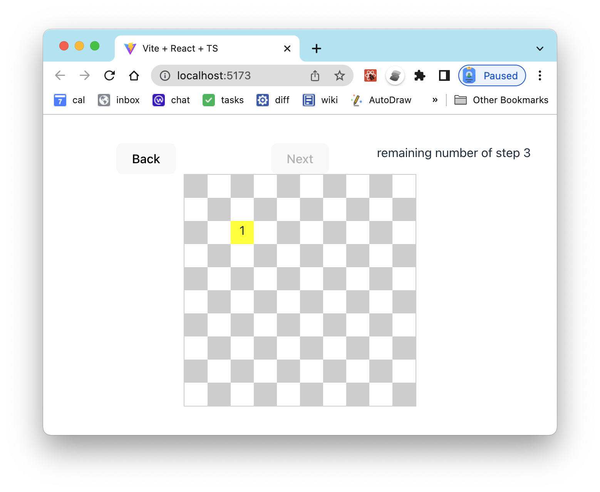
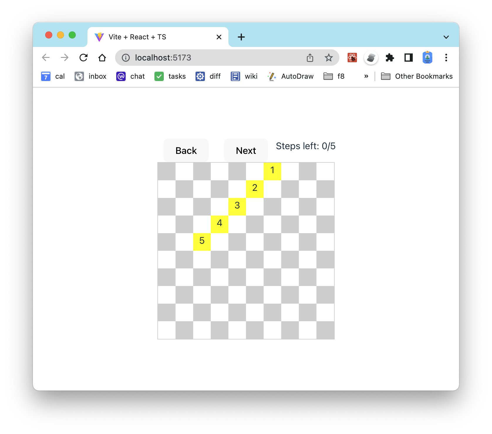
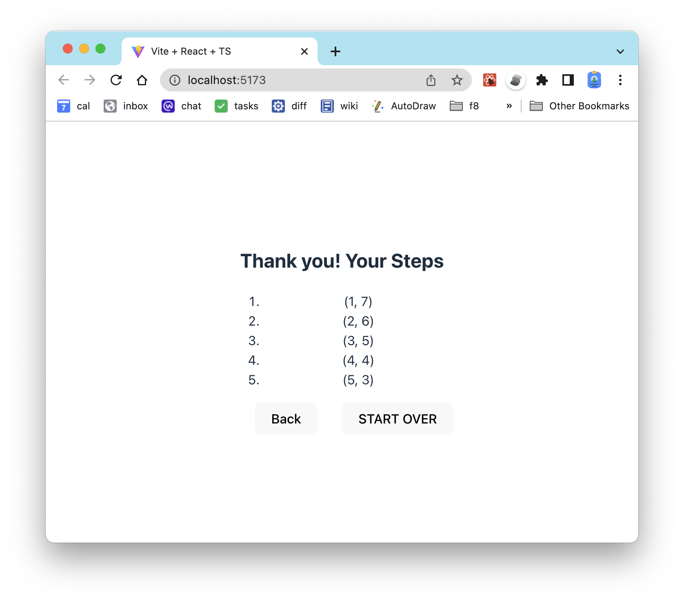
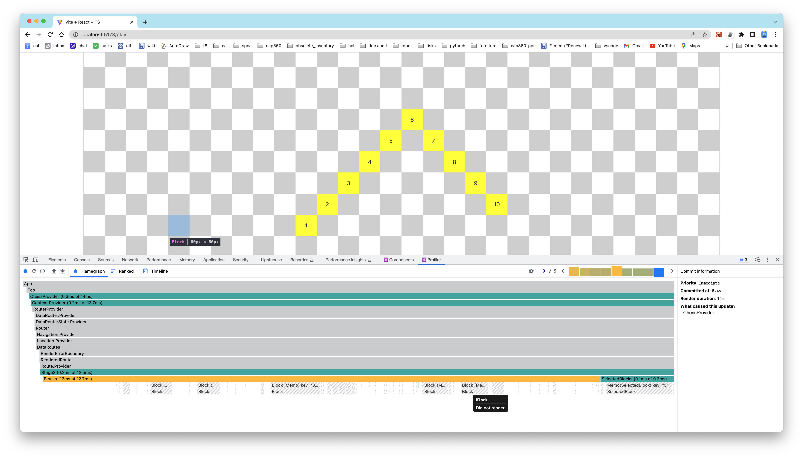

# Chess Board
1. able to define the size of the chess board
1. set the user max number of steps
1. able go to previou next step
1. able go next step when the condition is met
1. able to back track a step (undo selected step)
1. only allow adjacent step to be selected
1. able to select block with keyboard key `ArrowUp`, `ArrowDown`, `ArrowLeft`, `ArrowRight`
1. able to use react router to go betweem `/setup`, `/play`, `/thankyou`

# Demo
A quick demo of using the chessboard

# React Hooks
1. states
   1. `size`: size of the chess board NxN
   1. `maxSteps`: allowable number of selected blocks (or position)
   1. `steps`: a list of selected blocks (or positions)
   1. `lastStep`: last selected block (or positions)
   1. `stage`: three stages (1. start, 2. play, 3. done)
1. generated states
   1. `nxn`: generate array of positions for blocks
   1. `nxnGrid`: generate css-template-area for blocks
   1. `isDone`: reach stage 3
   1. `sizeChess`: overall dimension (width, height) of the whole chess block
   1. `sizeBlock`: dimension (width, height) of each block.
   1. `remaingingStep`: available number of unselect step
   1. `lastSelectedStep`: last recently selected block
   1. `lastSelectedStepAdjacentSteps`: adjacent blocks around the last recently selected block
1. helper functions
   1. `getRandomBlock`: pick a random block (or position)
   1. `isBlockSelected`: if the block is already selected
   1. `getBlockSelectedIndex`: get the inde for block (or position) from the selected steps (blocks or positions).
   1. `clickBlock`: select block if the block is adjacent the the recent selected block and is not selected yet.
   1. `toggleBlock`: if the clicked block is last selected block, it can be unselected. if the clicked block is not selected and adjacent to the recent block, select the block.
   1. `isPositionAdjacent`: is one position adjacent to another position
   1. `getPositionKey`: the string representation o a `Position`

# Components
1. `<RouterProvider>`
   1. `<ChessProvider>`
      1. `/setup`: `<Setup>`
      1. `/play`: `<Play>`
         1. `<Blocks><BlockMemo>...</Blocks>`
         1. `<SelectedBlocks><SelectedBlockMemo>...</SelectedBlocks>`
      1. `/thankyou`: `<Thankyou>`
         1. `<SelectedSteps>`
      1. `/*`: `<Play>`

# Styles Helpers
1. `<Setup>`: use `SETUP_*STYLE`
1. `<Play>`: use `PLAY_*STYLE`, `PlayStyle()`
1. `<Thankyou>`: use `THANKYOU_STYLE`

# Screenshots

## step1

## step2

## step3

## re-rendering optimization
only re-render components that is changed, as shown in the bottom two lines, which is mostly greyout (not render). a list of child `<Block/>` for parent `<Blocks>` and a list of child `<SelectedBlock/>` for parent `<SelecteBlocks/>`.
