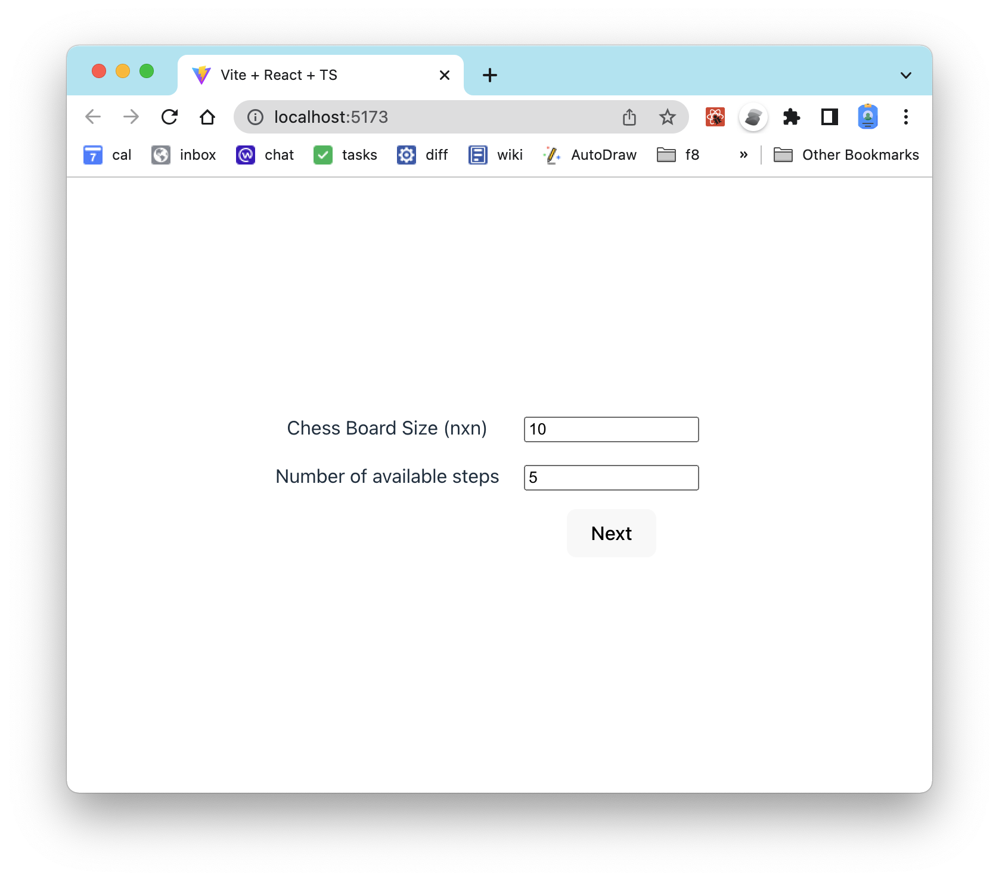
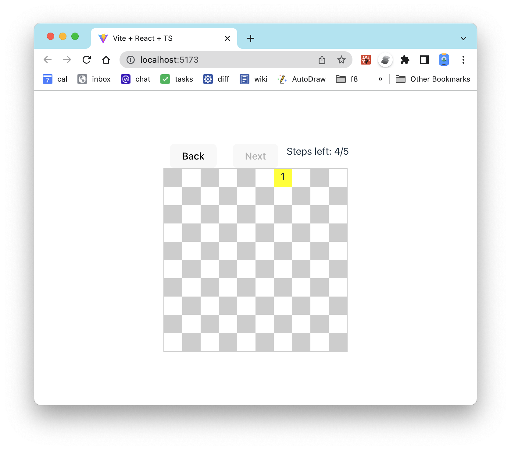

# Chess Board
1. able to define the size of the chess board
1. set the user max number of steps
1. able go to previou next step
1. able go next step when the condition is met
1. able to back track a step (undo selected step)
1. only allow adjacent step to be selected

# React Hooks
1. states
   1. size: size of the chess board NxN
   1. maxSteps: allowable number of selected blocks (or position)
   1. steps: a list of selected blocks (or positions)
   1. lastStep: last selected block (or positions)
   1. stage: three stages (1. start, 2. play, 3. done)
1. generated states
   1. nxn: generate arary of positions for blocks
   1. isDone: reach stage 3
   1. sizeChess: overall dimension (width, height) of the whole chess block
   1. sizeBlock: dimension (width, height) of each block.
   1. remaingingStep: available number of unselect step
1. helper functions
   1. setFristPositionRandomly: pick a random block (or position)
   1. isBlockSelected: if the block is already selected
   1. getBlockSelectedIndex: get the inde for block (or position) from the selected steps (blocks or positions).
   1. clickBlock: select block if the block is adjacent the the recent selected block and is not selected yet.
   1. toggleBlock: if the clicked block is last selected block, it can be unselected. if the clicked block is not selected and adjacent to the recent block, select the block.

# Components
1. `<ChessProvider>`
   1. `<Steps>`
      1. `<Step1>`
      1. `<Step2>`
         1. `<Blocks>`
            1. `<Block>`
      1. `<Step3>`
         1. `<Steps>`

## step1

## step2

## step3

